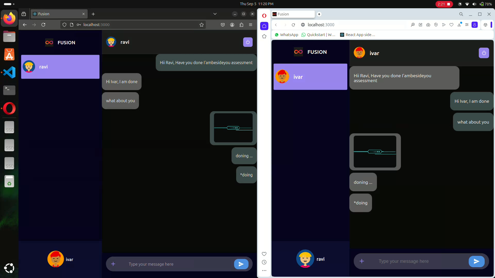

# Project Status:
- **Live at**: [`https://fusion-virid.vercel.app`](https://fusion-virid.vercel.app)
- ⚠️ **Note**: The application may take a few seconds to load initially due to the cold start of the render servers (where the backend is hosted).
  
## Features:
- One-to-One Live Chat with support for all file types.
- In-application play for all media files (audio, video, images).
- Real-time status of all online users.

# High Level System Design:


# Demo:
- Click on image 
[](https://vimeo.com/1006690376?share=copy#t=0)


# Setting Application

### First setup backend and then frontend:

### Backend

The backend is implemented with Nodejs using MongoDb as database.

### Setup:
- First make a .env file and add following key-value:
```
PORT=3002
MONGO_URL=''
```
- To install the necessary dependencies, run `npm install`
- Start the Development Server `npm start`
- Backend server will be running on port as per `.env` file.
- To check server status, make a ping request from browser on : `http://localhost:PORT/ping`.

### Frontend

The frontend is built with React.
### Setup:
- Clone repo: `git clone https://github.com/ravi-ivar-7/fusion.git `
- `cd frontend
-Now make a .env file and add following key-value:
```
FAST_REFRESH=false
BROWSER=none

REACT_APP_LOCALHOST_KEY="any-random-key"
REACT_APP_NODEJS_BACKEND_URL='http://localhost:3002'
```
- Packages Installation ` npm install`
- Start the Development Server `npm start`

## Testing

- Open `http://localhost:3000` in browser and authenticate.

- Open `http://localhost:3000` in another browser and authenticate with different credentials.

- Now send messages or files between both users.


